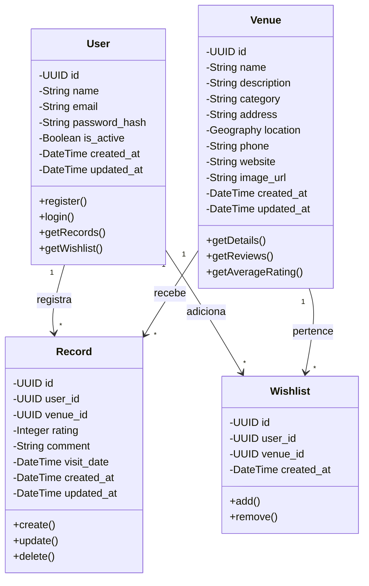
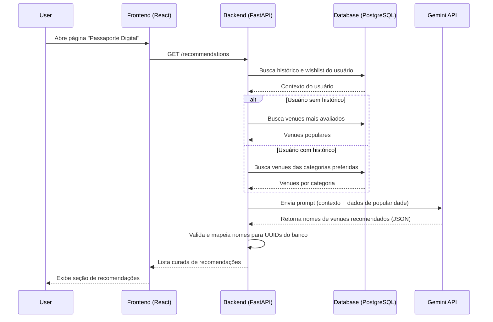

# TP1 - Engenharia de Software

Repositório para controle de versão do primeiro Trabalho Prático da disciplina de Engenharia de Software, do DCC/UFMG (2026.1).

# KULTI: Seu passaporte digital para descobrir e registrar museus, galerias e arte.

## Sumário

- [Membros e Funções](#membros-e-funções)
- [Objetivo do Sistema](#objetivo-do-sistema)
- [Acesso](#acesso)
- [Tarefa 1](#tarefa-1)
  - [Histórias de Usuários (MVP)](#histórias-de-usuários-mvp)
  - [Tecnologias](#tecnologias)
- [Entregas TP1](#entregas-tp1)
  - [Diagramas UML](#diagramas-uml)
  - [Documentação](#documentação)

## Membros e Funções

Todos os membros atuaram de forma generalista, contribuindo com frontend, backend, UI/UX e engenharia de dados conforme a demanda de cada sprint.

- Clarice Oliveira Minobolli Teixeira
- José Gabriel Silva
- Kauan Teixeira Pereira
- Lucas da Silva Santos

## Objetivo do Sistema

KULTI é uma plataforma web criada para admiradores de arte e turistas que veem os grandes serviços de mapas como muito desorganizados para uma exploração cultural. O sistema oferece um mapa selecionado de museus e galerias, permitindo que os usuários registrem visitas, escrevam avaliações e sigam os roteiros de outros. Ao integrar um LLM, a plataforma oferece recomendações personalizadas com base nas preferências e na localização do usuário. Seu objetivo é simplificar o turismo cultural, substituindo as informações dispersas por um guia de arte especializado e colaborativo.

## Acesso

- **Aplicação hospedada:** [https://kulti-frontend.onrender.com/](https://kulti-frontend.onrender.com/) _(serviços gratuitos — o desempenho geral pode ser afetado)_

## Tarefa 1

### Histórias de Usuários (MVP)

1. Como visitante da plataforma, quero criar uma conta para salvar minhas atividades e preferências.
2. Como usuário da plataforma, quero visualizar no mapa museus e galerias próximos para descobrir locais de interesse.
3. Como usuário da plataforma, quero visualizar detalhes de um local selecionado no mapa para conhecer melhor o local antes de visitá-lo.
4. Como usuário da plataforma, quero filtrar locais por categorias (ex.: Arte Contemporânea, História) para encontrar opções alinhadas aos meus interesses.
5. Como usuário da plataforma, quero registrar que visitei um local para manter um histórico das minhas visitas culturais (passaporte digital).
6. Como usuário da plataforma, quero avaliar um local com uma nota para compartilhar minha experiência.
7. Como usuário da plataforma, quero adicionar locais a uma lista de lugares que pretendo visitar no futuro.
8. Como usuário da plataforma, quero receber sugestões de roteiros culturais com base nas minhas preferências (via IA) para facilitar o planejamento de visitas.

### Tecnologias

- **Linguagens/Frameworks:** React.js, FastAPI (Python)
- **Banco de Dados:** PostgreSQL (com PostGIS)
- **Agentes de IA (Desenvolvimento):** Cursor, Kiro, Codex, Gemini, ChatGPT, Github Copilot e Figma Make
- **IA Integrada (Sistema):** Gemini API

## Entregas TP1

### Diagramas UML

#### Diagrama de Classes (Modelo de Domínio)

O sistema é composto por quatro classes principais: User, Venue, Record e Wishlist. O diagrama de classes abaixo representa o modelo de domínio com atributos, métodos e relacionamentos entre as entidades.

#### Diagrama de Sequência (Fluxo de Recomendação via IA)

O principal diferencial do KULTI é a recomendação personalizada de roteiros culturais via LLM. O diagrama a seguir detalha a interação entre os componentes quando o usuário solicita sugestões: o backend consulta o histórico de visitas, monta um prompt contextualizado e envia à Gemini API, validando a resposta antes de devolvê-la ao frontend.

> Você pode encontrar mais informações e um diagrama de atividades em [docs/guidelines/ai-suggestions-behavior.md](docs/guidelines/ai-suggestions-behavior.md) (em inglês).

### Documentação

Você pode começar a explorar a documentação do projeto a partir de [docs/INDEX.md](docs/INDEX.md) (em inglês).
