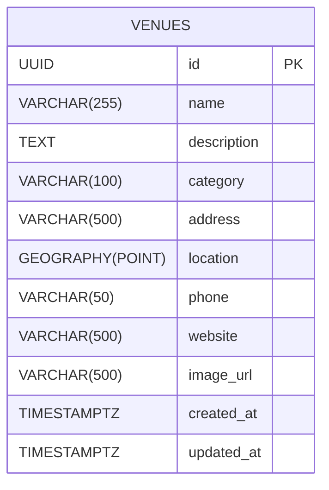

# Venue Entity Diagram

## Column Notes

| Column | Purpose | User Story |
|--------|---------|------------|
| `name` | Venue display name | US2, US3 |
| `description` | Detailed info shown on venue page | US3 |
| `category` | Filter by type (e.g. "Contemporary Art", "History") | US4 |
| `address` | Human-readable address | US3 |
| `location` | PostGIS POINT (SRID 4326) for map display and proximity queries | US2 |
| `phone` | Contact info | US3 |
| `website` | External link | US3 |
| `image_url` | Venue photo | US3 |
