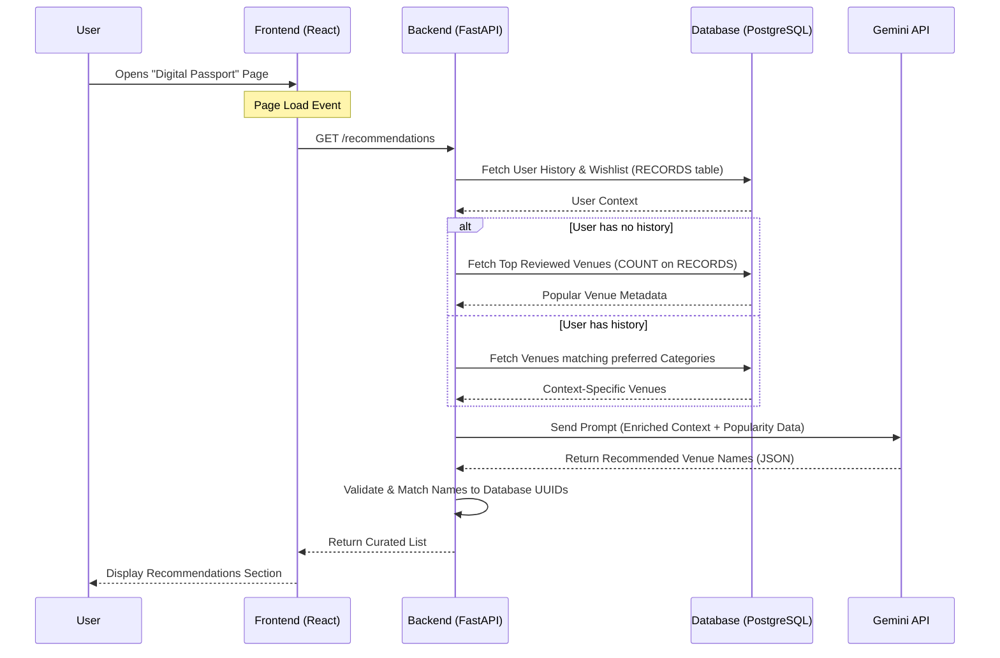
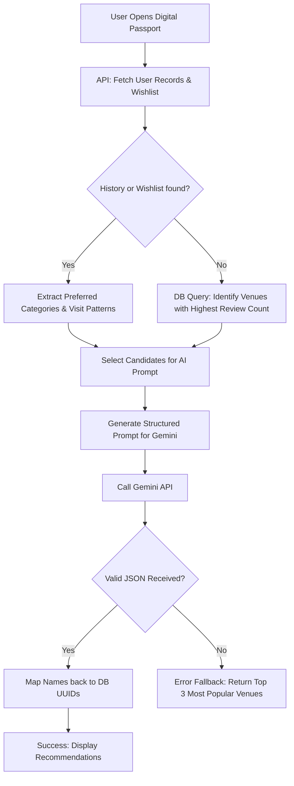

[← Back to Index](../INDEX.md)

# AI Suggestions Behavior

This document defines the logic and flow for the KULTI recommendation system powered by the Gemini API. It ensures that AI suggestions are contextually relevant, geographically feasible, and technically reliable.

## 1. Interaction Flow (Sequence Diagram)

This diagram illustrates how the system coordinates between the user, the local PostGIS database, and the external Gemini API.

## 2. Decision Logic (Flowchart)

This flowchart defines the internal logic used to filter data and handle potential AI errors.

## 3. Rationale & Justifications

* **Hallucination Protection**: The system sends venue names and metadata to the AI but performs the ID matching on the backend. This prevents the hallucination of non-existent UUIDs, ensuring the system never attempts to display a venue that doesn't exist in the PostgreSQL database.

* **Popularity-Based Fallback**: For users without history, the system identifies "popular" venues by calculating the frequency of entries for each `venue_id` within the `RECORDS` table. This uses existing data without requiring new tables or columns.

* **Consistency with ADR-004**: In alignment with ADR-004, popularity is computed on-demand via queries rather than being stored as a denormalized "rating_count" column in the `VENUES` table.

* **Consistent Spatial Logic**: The logic explicitly uses the coordinates stored in the `location` column to maintain consistency with the spatial indexing strategy defined in the database schema.

## 4. Implementation Notes

* **API Response**: The Gemini API must be instructed to return data in a structured JSON format so the FastAPI backend can parse it without complex text processing.

* **Data Minimization**: Only necessary metadata (Name, Category, Description) is sent to the AI to stay within free-tier rate limits and ensure faster response times.

* **Popularity Query**: The backend identifies popular venues by performing a `GROUP BY venue_id` and `COUNT(*)` on the `RECORDS` table.