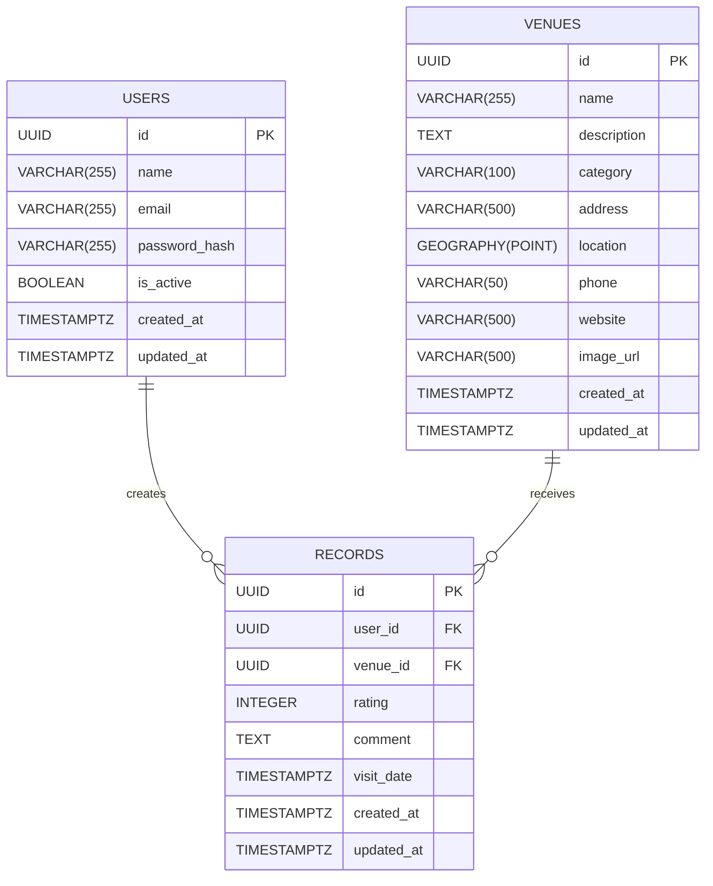

[← Back to Index](../INDEX.md)

# Database Schema

> Single source of truth for KULTI's data model. Update this file whenever a table is added or changed.

## ER Diagram

## Conventions

- All primary keys are **UUIDs** (client-side generation, no DB round-trip).
- All tables include `created_at` and `updated_at` with timezone-aware timestamps.
- Geographic columns use **PostGIS `Geography`** (SRID 4326, WGS 84).
- Pydantic schemas expose `latitude`/`longitude` instead of raw PostGIS types (see [ADR-001](../adr/adr-001-orm-choice.md)).

## Tables

### users

Represents registered platform users and provides the base for authentication.

| Column | Type | Nullable | Purpose | User Story |
|--------|------|----------|---------|------------|
| `id` | UUID | PK | Unique identifier | US1 |
| `name` | VARCHAR(255) | No | User display name | US1 |
| `email` | VARCHAR(255) | No | Login identifier | US1 |
| `password_hash` | VARCHAR(255) | No | Hashed password for authentication | US1 |
| `is_active` | BOOLEAN | No | Soft activation flag for auth checks | US1 |
| `created_at` | TIMESTAMPTZ | No | Row creation time (server default) | — |
| `updated_at` | TIMESTAMPTZ | No | Last update time (auto-updated) | — |

Unique constraint: `email`.

### venues

Represents museums and galleries — the core entity of KULTI.

| Column | Type | Nullable | Purpose | User Story |
|--------|------|----------|---------|------------|
| `id` | UUID | PK | Unique identifier | — |
| `name` | VARCHAR(255) | No | Venue display name | US2, US3 |
| `description` | TEXT | Yes | Detailed info shown on venue page | US3 |
| `category` | VARCHAR(100) | No | Filter by type (e.g. "Contemporary Art", "History") | US4, US8 |
| `address` | VARCHAR(500) | No | Human-readable address | US3 |
| `location` | GEOGRAPHY(POINT, 4326) | No | Coordinates for map display and proximity queries | US2 |
| `phone` | VARCHAR(50) | Yes | Contact info | US3 |
| `website` | VARCHAR(500) | Yes | External link | US3 |
| `image_url` | VARCHAR(500) | Yes | Venue photo | US3 |
| `created_at` | TIMESTAMPTZ | No | Row creation time (server default) | — |
| `updated_at` | TIMESTAMPTZ | No | Last update time (auto-updated) | — |

Spatial index: GiST on `location` (auto-created by GeoAlchemy2).

See [ADR-003](../adr/adr-003-venue-modeling.md) for modeling decisions.

### records

Represents visit records and ratings — the association between users and venues. Each record documents a user's visit to a venue with a rating and optional comment.

| Column | Type | Nullable | Purpose | User Story |
|--------|------|----------|---------|------------||
| `id` | UUID | PK | Unique identifier | — |
| `user_id` | UUID | No | Foreign key to `users.id` | US5, US6 |
| `venue_id` | UUID | No | Foreign key to `venues.id` | US5, US6 |
| `rating` | INTEGER | No | Numeric rating (1–5 stars) | US6 |
| `comment` | TEXT | Yes | User's written review or notes | US6 |
| `visit_date` | TIMESTAMPTZ | Yes | Date of the museum visit | US5 |
| `created_at` | TIMESTAMPTZ | No | Row creation time (server default) | — |
| `updated_at` | TIMESTAMPTZ | No | Last update time (auto-updated) | — |

Unique constraint: `(user_id, venue_id)` — ensures each user has at most one record per venue.

Foreign keys:
- `user_id` → `users.id`
- `venue_id` → `venues.id`

See [ADR-004](../adr/adr-004-average-rating-strategy.md) for rating aggregation strategy.